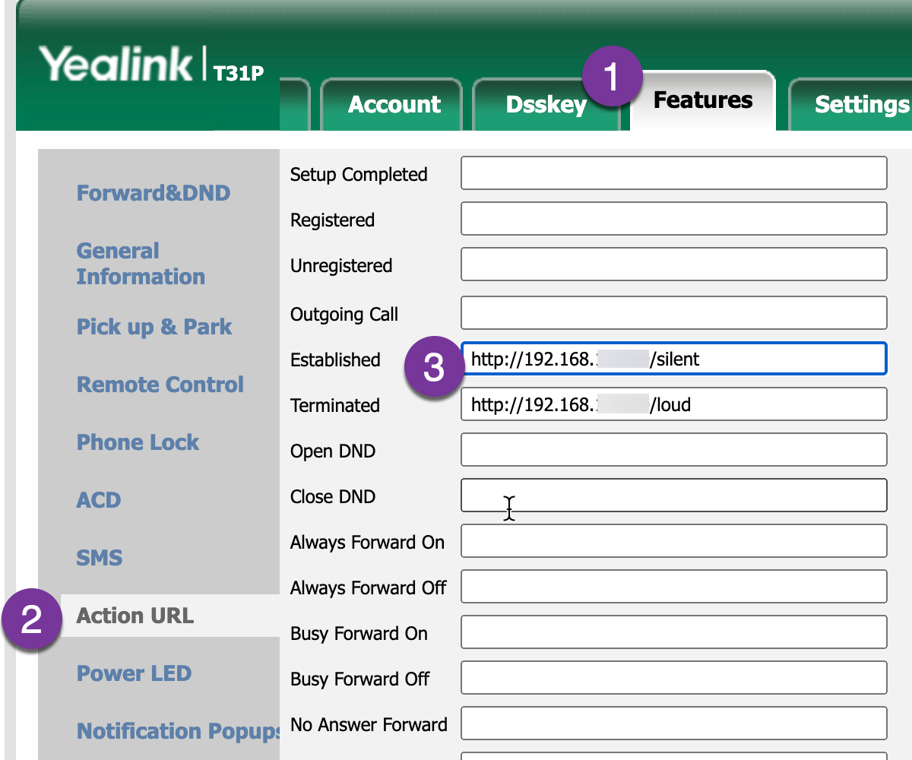

# radiosilence
enforce radio silence during phone calls


## install 

```bash
cd /opt
sudo mkdir radiosilence
sudo chown pi radiosilence
git clone https://github.com/blemli/radiosilence && cd radiosilence
sudo chmod +x install.sh && ./install.sh

```

### on the phone


## usage
send a http get request to `http://<ip>/silent` to mute the speaker or `http://<ip>/loud` to un-mute it.

## learned
yealink phone doesn't do mDNS.

## etymology
radio silence is a term used in the military to enforce a period of radio silence. It is used to prevent the enemy from intercepting messages. The term is also used in the context of radio broadcasting to refer to a period during which a station or network will not broadcast any programming.

